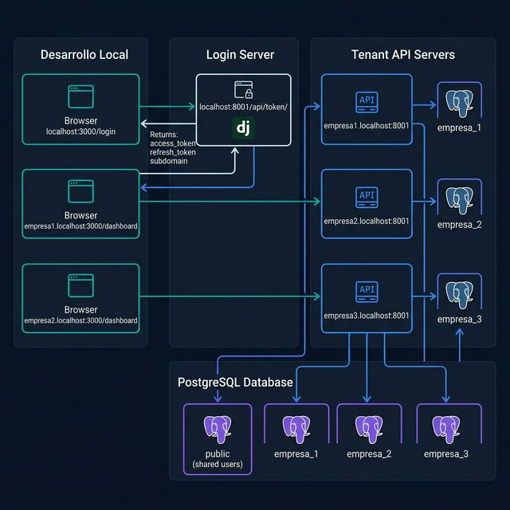
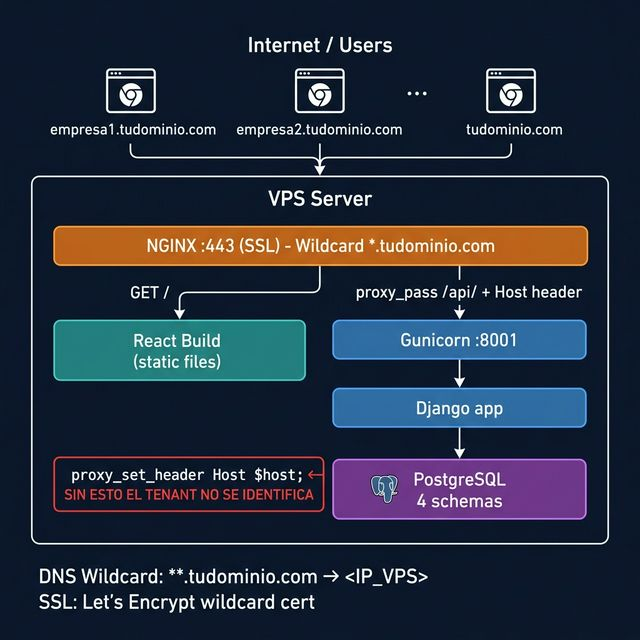
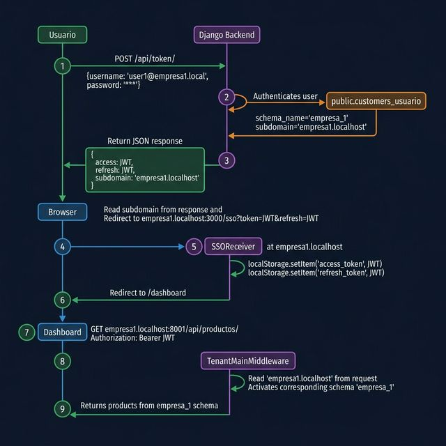

# Diagramas de Arquitectura Multi-Tenant

## Diagrama 1 — Topología en Desarrollo Local



**Puntos clave:**
- El login siempre ocurre en `localhost:3000/login` → `localhost:8001/api/token/`
- El backend responde con el `subdomain` del tenant correspondiente
- El frontend redirige al subdominio (`empresa1.localhost:3000/sso`)
- Cada subdominio tiene su propio `localStorage` aislado → tokens separados
- Los productos se sirven desde `empresaN.localhost:8001` que activa el schema `empresa_N`

---

## Diagrama 2 — Topología en VPS Producción



**Puntos clave:**
- Un solo servidor VPS sirve todos los subdominios con DNS wildcard `*.tudominio.com`
- NGINX actúa como proxy inverso y maneja SSL
- **`proxy_set_header Host $host;`** es CRÍTICO — sin esto, Django recibe `localhost` en vez del subdominio y el middleware no puede identificar el tenant
- El build de React es estático (un solo build para todos los subdominios)
- Gunicorn corre Django en modo producción en el puerto 8001 (solo localhost, no expuesto)

---

## Diagrama 3 — Flujo completo de Login



**Pasos detallados:**

| # | Actor | Acción |
|---|-------|--------|
| 1 | Browser | POST /api/token/ con `{username, password}` |
| 2 | Django | Autentica contra `public.customers_usuario` (schema compartido) |
| 3 | Django | Genera JWT con `schema='empresa_1'` en el payload, retorna `subdomain` |
| 4 | Login.js | Lee `subdomain`, redirige a `empresa1.localhost:3000/sso?token=JWT&refresh=JWT` |
| 5 | SSOReceiver | Guarda `access_token` y `refresh_token` en localStorage de **ese subdominio** |
| 6 | SSOReceiver | Redirige a `/dashboard` |
| 7 | Dashboard | GET `empresa1.localhost:8001/api/productos/` con `Authorization: Bearer JWT` |
| 8 | TenantMiddleware | Lee Host: `empresa1.localhost` → busca en `customers_domain` → activa schema `empresa_1` |
| 9 | ProductoViewSet | `Producto.objects.all()` en schema `empresa_1` → retorna productos |

---

## El aislamiento de datos en PostgreSQL

```
PostgreSQL Server
│
├── schema: public          ← compartido entre todos
│   ├── customers_usuario   ← TODOS los usuarios del sistema
│   ├── customers_client    ← registro de tenants (empresas)
│   └── customers_domain    ← dominios vinculados a cada tenant
│
├── schema: empresa_1       ← datos EXCLUSIVOS de Empresa 1
│   └── app_negocio_producto
│
├── schema: empresa_2
│   └── app_negocio_producto
│
└── schema: empresa_3
    └── app_negocio_producto
```

Un usuario de empresa2 que logre obtener un JWT de empresa1 **NO PUEDE** acceder a sus datos porque el middleware identifica el tenant por el **Host header** del request (subdominio), no por el JWT.

La seguridad real está en la activación del schema PostgreSQL por el middleware, que es transparente para el usuario.
